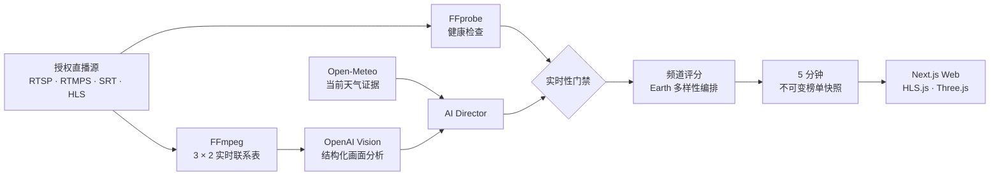

<div align="center">


<h1>LiveEarth</h1>

<p><strong>此刻，地球最好一幕。</strong><br/><sub>The best view on Earth, right now.</sub></p>

<p>
  
  <a href="https://nextjs.org/"></a>
  <a href="https://react.dev/"></a>
  <a href="https://www.typescriptlang.org/"></a>
  <a href="https://threejs.org/"></a>
  <a href="https://supabase.com/"></a>
</p>

<p><strong>快速导航</strong>：
  <a href="#为什么做-liveearth">项目定位</a> ·
  <a href="#核心能力">核心能力</a> ·
  <a href="#快速开始">快速开始</a> ·
  <a href="#架构">架构</a> ·
  <a href="#api-速览">API</a> ·
  <a href="#生产部署">部署</a>
</p>

</div>

LiveEarth 把分散在全球的授权直播源，收拢成一个由 AI 主持的实时频道：系统持续检查镜头、理解当前画面、生成排名理由，并把此刻最值得看的场景编排成一份稳定的全球 Top 10。

用户不需要搜索下一站。打开首页，AI Director 已经在替你看地球。

---

## 为什么做 LiveEarth

**雷暴有空窗、极光有季节、海浪和城市夜景也各有自己的时间。地球没有。**

把 Storm、Ocean、Night 等主题拆成孤立产品，每个频道都会遇到内容低谷；LiveEarth 用一个总榜承接所有频道，让最值得看的画面自然接力。

| 找到 | 看懂 | 编排 |
|:---|:---|:---|
| 持续探测全球授权直播源 | 用实时画面与天气证据理解正在发生什么 | 综合质量、罕见性、新鲜度与多样性生成节目单 |
| 自动剔除离线、降级和过期镜头 | 输出中英双语标签、分数与一句话理由 | 控制频道与国家重复，避免 Top 10 变成同类画面堆叠 |

> **`Live` 不是一个 UI 标签。** 最近画面超过 90 秒、视觉分析超过 10 分钟，或流状态不再健康，场景就会退出公开榜单。没有合格镜头时，产品展示真实空状态，不用旧素材冒充直播。

---

## 核心能力

- **Earth Top 10**：每 5 分钟发布一份不可变榜单快照，保留排名升降和版本时间。
- **四个 MVP 频道**：`Earth` 总榜，以及 `Storm`、`Ocean`、`Night` 专题榜。
- **AI Director**：FFmpeg 抽取当前 3 × 2 联系表，结合 Open-Meteo 天气证据，通过 OpenAI 结构化输出完成画面评分与中英双语解说。
- **实时性门禁**：FFprobe 检查可播放性、码率与延迟；健康状态和分析新鲜度共同决定场景能否发布。
- **全球地球视图**：Three.js 地球按需加载，可从榜单飞往目标地点，并尊重系统的 reduced-motion 设置。
- **45 秒自动巡游**：首页自动切换当期精选场景，支持暂停、前后切换、键盘控制和用户触发后的原声播放。
- **场景档案**：展示直播、地理位置、AI 标签、上榜理由、评分拆解、24 小时趋势与相似场景。
- **账号与运营**：Supabase Magic Link / Google 登录、收藏与观看历史云同步、完整账户删除，以及受 allowlist 与 RLS 双重约束的直播源登记后台。
- **中英双语**：产品界面、场景标题和 AI 排名理由均支持 `/zh` 与 `/en`。

### 产品入口

| 页面 | 路径 | 作用 |
|:---|:---|:---|
| Top Now | `/zh` · `/en` | 当前 Earth Top 10、主舞台与自动巡游 |
| 频道榜 | `/zh/channel/storm` | Storm / Ocean / Night 独立排名 |
| 场景档案 | `/zh/scene/[slug]` | 直播、证据、分数历史与相似推荐 |
| 收藏 | `/zh/favorites` | 本地收藏；登录后与 Supabase 同步 |
| 运营后台 | `/zh/admin` | 校验授权合同并登记直播源 |

---

## 快速开始

### 前置要求

- Node.js `22+`
- Corepack（仓库固定使用 pnpm `10.26.0`）
- Docker 与 Docker Compose（仅在运行 Redis / Worker 时需要）

### 启动 Web

```bash
git clone https://github.com/skygazer42/LiveEarth.git
cd LiveEarth

corepack enable
corepack pnpm install --frozen-lockfile
cp apps/web/.env.local.example apps/web/.env.local
corepack pnpm dev
```

启动后访问：

| 入口 | 地址 |
|:---|:---|
| 中文界面 | [http://localhost:3000/zh](http://localhost:3000/zh) |
| English | [http://localhost:3000/en](http://localhost:3000/en) |
| 健康检查 | [http://localhost:3000/api/health](http://localhost:3000/api/health) |

本地开发默认使用展示用静态样例，因此无需云服务凭据即可查看完整产品流。只要 `NODE_ENV=production`，Demo 数据就会被强制关闭，真实数据为空时只显示空状态。

### 启动实时分析 Worker

```bash
docker compose up -d redis
cp apps/worker/.env.example apps/worker/.env

# 填写 Supabase、OpenAI、Open-Meteo 与 Cloudflare 凭据后启动
corepack pnpm dev:worker
```

Worker 会按配置周期执行直播探测、联系表抽帧、视觉分析和榜单发布。`apps/worker/.env` 中的云服务字段当前均为必填项。

---

## 架构



### 排名规则

频道分由六个可解释维度组成：画面冲击力 `30%`、事件强度 `20%`、运动感 `15%`、可见度 `15%`、技术质量 `10%`、罕见性 `10%`。

| 榜单 | 额外规则 |
|:---|:---|
| `Earth` | 使用编辑分：频道分 `50%` + 罕见性 `20%` + 新鲜度 `15%` + 时间相关性 `15%`；每个频道最多 4 个、每个国家最多 2 个，并尽量避免相邻同频道 |
| `Storm` | 必须有强天气代码，或从画面中识别到 lightning / thunder / storm 等证据 |
| `Ocean` | 按频道分排序，保留前一期排名作为轻量稳定性信号 |
| `Night` | 只有当地进入民用曙暮光后的镜头才有资格入榜 |

### 数据与权限

- 私有拉流地址只保存在 Supabase 服务端表中；浏览器只获取公开 HLS、海报和派生元数据。
- 新直播源登记后先创建为未发布场景，只有通过健康检查并获得新鲜 AI 分析后才进入榜单。
- 排名快照按 `channel + version` 唯一保存，客户端每 30 秒检查新一期，不在浏览器内临时重排。
- 用户只能访问自己的收藏和历史；运营写操作同时经过 `ADMIN_EMAILS` allowlist 与数据库 RLS。

---

## API 速览

| 方法 | 端点 | 说明 |
|:---|:---|:---|
| `GET` | `/api/health` | Web 服务健康检查 |
| `GET` | `/api/v1/rankings/:channel` | 获取 Earth / Storm / Ocean / Night 最新榜单快照 |
| `GET` | `/api/v1/scenes/:slug` | 获取单个场景档案 |
| `GET` | `/api/v1/globe?channel=earth` | 获取地球视图标记 |
| `GET` · `POST` · `DELETE` | `/api/v1/me/favorites` | 收藏查询、写入与删除 |
| `GET` · `POST` · `DELETE` | `/api/v1/me/history` | 观看历史查询、写入与清空 |
| `DELETE` | `/api/v1/me` | 删除当前账户及其个人数据 |
| `POST` | `/api/v1/admin/feeds` | 校验授权字段并登记直播源 |

公开读取接口带有 CDN 缓存与 stale-while-revalidate 策略；个人与运营接口要求有效 Supabase 会话。

---

## 技术栈

| 层 | 主要技术 |
|:---|:---|
| Web | Next.js 16 · React 19 · TypeScript 6 · HLS.js · React Three Fiber · Three.js |
| Domain | Zod 契约 · 纯函数评分 / 排序 · Vitest |
| Data & Auth | Supabase · PostgreSQL · Row Level Security · SSR Session |
| Worker | Node.js 22 · BullMQ · Redis · FFmpeg · FFprobe |
| AI & Evidence | OpenAI Responses API 结构化输出 · Open-Meteo Customer API |
| Deployment | Vercel · Docker · Fly.io 示例配置 |

---

## 目录结构

```text
.
├── apps/
│   ├── web/                 # Next.js 产品界面、认证与 Route Handlers
│   └── worker/              # 直播探测、抽帧、AI 分析与榜单调度
├── packages/
│   └── domain/              # 共享类型、Zod 契约、评分规则与测试
├── supabase/
│   └── migrations/          # 数据表、索引、触发器与 RLS 策略
├── docker-compose.yml       # 本地 Redis
├── vercel.json              # Web 部署配置
└── .env.example             # 生产环境变量总览
```

---

## 配置

| 文件 | 使用者 | 内容 |
|:---|:---|:---|
| `apps/web/.env.local.example` | Next.js | 站点 URL、Demo 开关、Supabase 公钥 / 服务端密钥、管理员邮箱 |
| `apps/worker/.env.example` | Worker | Redis、Supabase Service Role、OpenAI、Open-Meteo、Cloudflare 与调度周期 |
| `.env.example` | 部署者 | 两个进程所需变量的合并检查表 |

`SUPABASE_SERVICE_ROLE_KEY`、`OPENAI_API_KEY`、`OPEN_METEO_API_KEY`、Redis 和 Cloudflare 凭据只能注入服务端或 Worker，不能暴露给浏览器。

---

## 验证

```bash
corepack pnpm typecheck
corepack pnpm lint
corepack pnpm test:run
corepack pnpm build
docker compose config
```

当前基线已通过全仓 TypeScript 检查、ESLint、17 个 Vitest 用例、Next.js 生产构建，以及中英文首页 / 频道 / 场景的开发与生产烟测。

---

## 生产部署

1. 在 Supabase 执行 `supabase/migrations/001_liveearth.sql`，配置 Magic Link / Google OAuth 回调，并把首位运营者同时加入 `admin_users` 和 `ADMIN_EMAILS`。
2. 将 Web 变量配置到 Vercel；使用 `apps/worker/Dockerfile` 部署常驻 Worker，并连接持久化 Redis。`apps/worker/fly.toml.example` 提供 Fly.io 起点。
3. 逐条登记拥有明确展示、转码、抽帧分析、派生元数据和有限技术帧留存权的直播源。每条源都需要私有拉流地址、公开 HTTPS HLS 地址、HTTPS 海报和权利到期时间。
4. 拉流源不能直接公开播放时，在你有权使用的前提下，通过 Cloudflare Live Input 或自管 FFmpeg relay 转成公开 HLS。
5. 公开上线前，建议准备至少 12 条稳定授权源并完成 7 天稳定性观察，让 Top 10 和多样性约束有足够选择空间；这不是代码启动的硬条件。

仓库不会自动创建 Supabase、OpenAI、Open-Meteo、Cloudflare、Redis 或 Vercel 资源，也不附带可用于生产的摄像头授权。

---

## 当前范围

当前版本交付 `Earth`、`Storm`、`Ocean`、`Night` 四个频道。Snow、Aurora、Train、Rain 与 Sunset 仍属于后续频道方向，尚未作为真实数据管线交付。

欢迎通过 [Issue](https://github.com/skygazer42/LiveEarth/issues) 反馈问题或提交 Pull Request。提交前请运行上面的完整验证命令。
